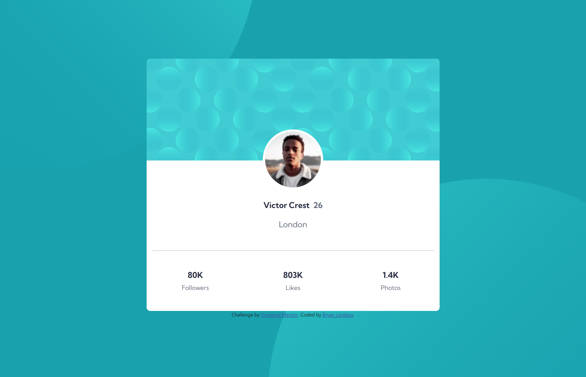
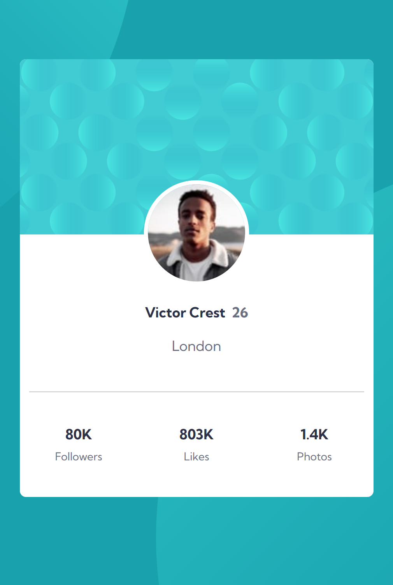

# Frontend Mentor - Profile card component solution

This is a solution to the [Profile card component challenge on Frontend Mentor](https://www.frontendmentor.io/challenges/profile-card-component-cfArpWshJ). Frontend Mentor challenges help you improve your coding skills by building realistic projects.

## Table of contents

* [Overview](#overview)
    * [The challenge](#the-challenge)
    * [Screenshot](#screenshot)
    * [Links](#links)
* [My process](#my-process)
    * [Built with](#built-with)
    * [What I learned](#what-i-learned)
    * [Continued development](#continued-development)
    * [Useful resources](#useful-resources)
* [Author](#author)

## Overview

### The challenge

* Build out the project to the designs provided

### Screenshot




### Links

* Solution URL: [Add solution URL here](https://your-solution-url.com)
* Live Site URL: [Add live site URL here](https://your-live-site-url.com)

## My process

### Built with

* Semantic HTML5 markup
* Bootstrap
* CSS Grid
* Mobile-first workflow
* Sass


### What I learned

I became more familiar with using multiple background elements to decorate the background and I also used mixins from Sass.

``` scss
@mixin background {
    background: url(./images/bg-pattern-top.svg) top left no-repeat, url(./images/bg-pattern-bottom.svg) bottom right no-repeat;
    background-color: $background;
    padding: 10% 25%;
    background-position: -400px -600px, 600px 400px;
}

.background {
   @include background;
}
```

### Continued development

Use this section to outline areas that you want to continue focusing on in future projects. These could be concepts you're still not completely comfortable with or techniques you found useful that you want to refine and perfect.
<br>
## Author

* Website - [Add your name here](https://www.your-site.com)
* Frontend Mentor - [@yourusername](https://www.frontendmentor.io/profile/yourusername)
* Twitter - [@yourusername](https://www.twitter.com/yourusername)